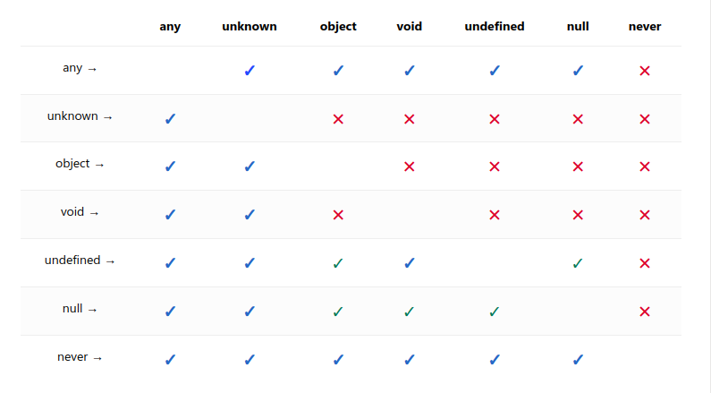

- **Installation**
```
sudo npm i -g typescript

tsc -v
```

- **Setup TS**
```
npm init -y

tsc --init
```

- **Transpile TS to JS**
```
tsc fileName.ts

tsc -w  //auto compile

tsc  //all compile
```

- **Types**

`Number`
`String`
`Boolean`
`Null`
`Undefined`
`Void`
`Object`
`Array`
`Tuples`
`....`
`Any`
`Never`
`unknown`




- **Situations**

`A function accepts 2 numbers`
`A function returns a string`


- **Syntax**

`let variableName: type = value`

